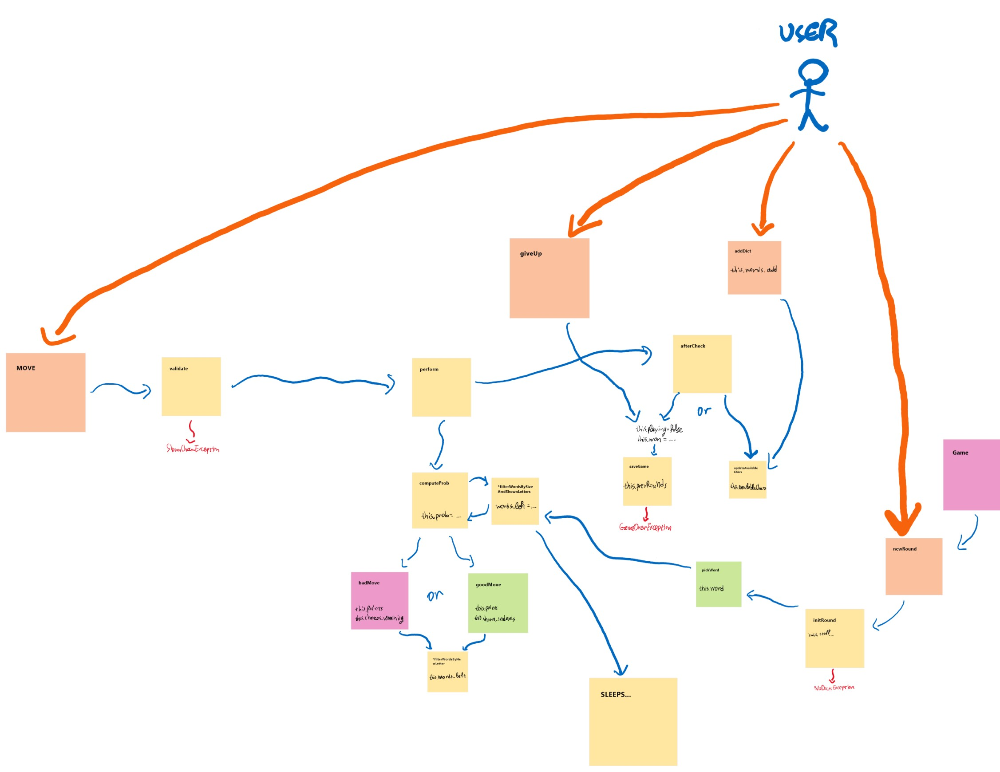
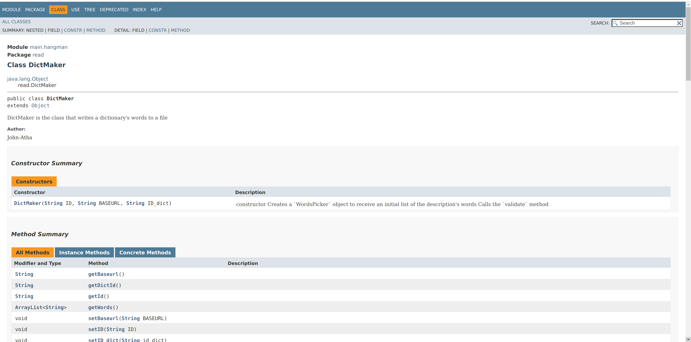
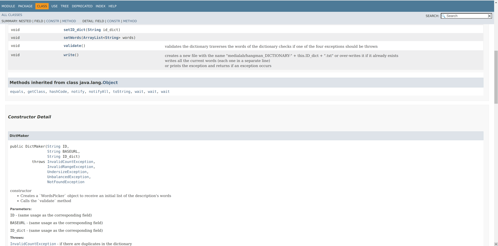
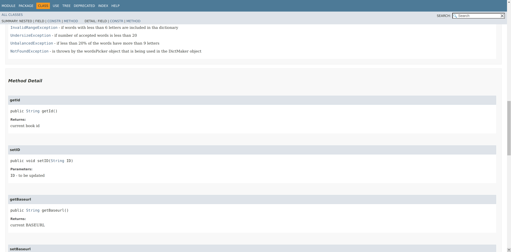
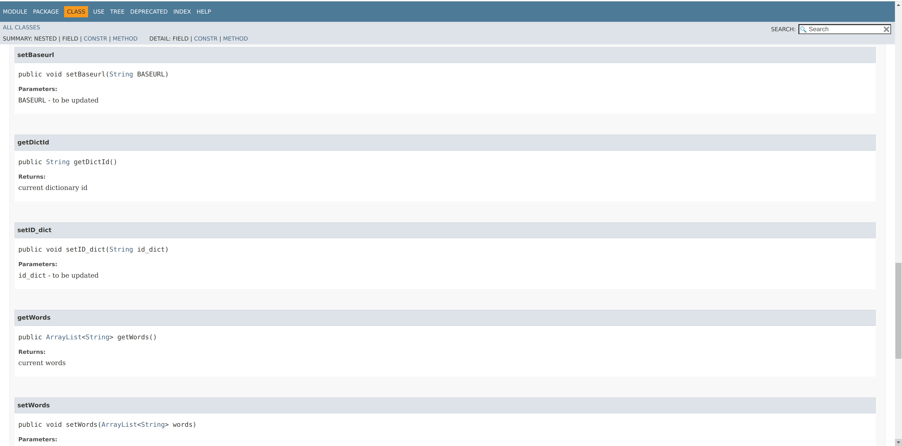
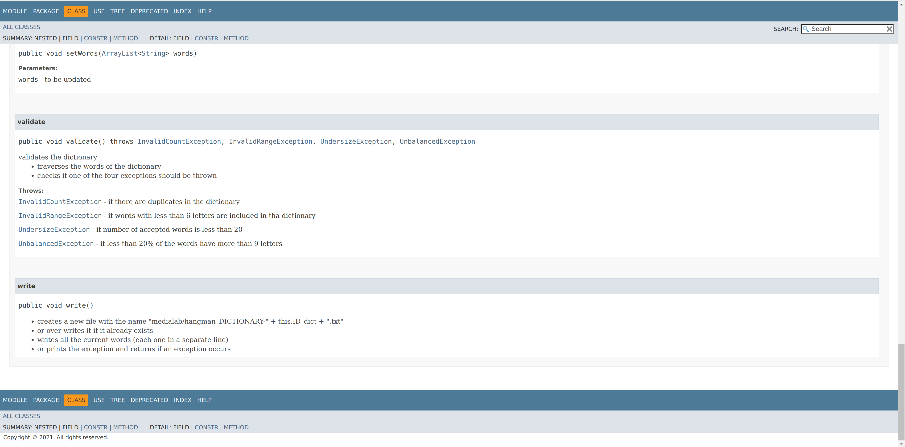

# MULTIMEDIA TECHNOLOGIES NTUA COURSE 2021-2022

## Hangman game

* This repo contains the source code of the course's project. 
* The project is a [JAVAFX](https://openjfx.io/) project.
* It was developed in IntelliJ IDEA.

### Logic of the game

* Before starting playing, users need to load one or more `dictionaries` (from the `Top Menu` component), using the [Books API](https://openlibrary.org/dev/docs/api/books) of the [Open Library](https://openlibrary.org/developers/api) service 
* The `hidden word` of each round is chosen randomly from the loaded dictionaries.
* Then, the user can start playing.
* At each round, the user is allowed to make 6 wrong guesses of characters, before losing.
* The remaining chances are shown in the left part of the screen `Chances Remaining`.
* At each move, he/she has to specify a new position and the letter that is hidding there using the `Character Form` on the bottom of the screen.
* For each position, there are some character suggestions shown by the app on the right section of the screen `Characters Left`.
    * These are the characters that can possibly be a match for this position, sorted (inversely) by their `possibility`.
    * I made the assumption that the user is not obligated to pick one of these characters when making a move.
* At each round, user also gathers some points, which are re-initialized to 0 when a new round begins.
  * According to the `possibility` of a character for a certain position, the user is being rewarded with a different amount of points for finding this character.
  * Each time a user makes a wrong guess, he/she loses 15 points.
* Some basic information ab the state of the game are also shown at the `Game Header`
* Using the `Top Menu`, the user can:
    * start a new game `Application->Start` (re-starts the running round and counts a loss)
    * load a dictionary `Application->Load` (re-starts the running round and counts a loss)
    * create a new dictionary `Application->Create`
    * close the app `Application->Exit`
    * see some statistics for all the dictionaries loaded `Details->Dictionary`
    * see some basic information for the last 5 rounds `Details->Rounds`
    * see the solution of the running round `Details->Solution` (stops the running round and counts a loss)

### Packages organization - Development Process

* According to their functionality, I decided to split the classes in four main packages:
    1. `main.hangman` to keep the core classes of the App
    2. `components` to keep the UI components
    3. `helpers` to keep some helper sub-classes
    4. `exceptions` to keep the exceptions classes
    5. `read` to keep the classes used for the reading proccess

#### main.hangmann
* This package contains the two main classes:
    * `App`: the main class to run the application
    * `Game`: this class is the object where all the state of the game is kept and will be analyzed later
    
#### Components
* I considered a good practice to split the components in two main categories, 
those that are shown as `pop-ups` and those that are `sections` of the main layout.
* So I splitted them in two sub-packages:
    1. popups
        * `load-dictionary-popup`, `create-dictionary-popup`, etc.
    2. sections
        * `top-menu`, `game-header`, `characters-form`, etc.
* Bearing in mind that the sections should be updated whenever the state of the game is being modified:
    * I designed the classes to be constructed based on a 'Game` object
    * I built the abstract class `UpdatableSection` which is being extended by all the sections and therefore forces them to support an `update` method.
    * So, whenever I need to `synchronize` one of the components with the game's state, I use this `update` method.
    
#### Exceptions
* Some common exceptions are raised when loading a dictionary, or when the execution of the game reaches a special state, such as the `GameOverException`.

#### Helpers
* I decided to build and keep in this package the class `MyStyles`, where I keep the styling properties used in the different UI components.

#### Read
* The logical process that I followed when developing this package, is to have a different class for each main part of the reading proccess:
    * For the creation of a dictionary:
        * The class `DataFetcher` makes the API request and keeps the description of the book with the specified ID or throws a `NotFoundException` if the provided URL is invalid.
        * The class `WordsPicker`, uses `DataFetcher` to get the data, tokenizes the description, and stores (in uppercase) only the words with more than 6 characters.
        * The class `DictMaker`, uses the `WordsPicker` to get the list of the words` and saves the dictionary in the file `medialab/hangman_DICTIONARY-id.txt` or throws one of the exceptions  `InvalidCountException`, `InvalidRangeException`, `UnbalancedException`, `UndersizeException`.
    * For the reading of a dictionary:
        * The class `DictReader` receives the ID of a dictionary and returns an array with its words, or throws a `FileNotFoundException`.
* Some `“Open Library IDs` that lead to certain cases:
    * OL45883W => success
    * OL262452W => undersize exception
    * OL31390631M => invalidCount exception

### Some important conventions to keep the project simple
* In the cases when I had to import some static files from the project's directory:
    * such as:
        * loading a txt dictionary from the medialab directory,
        * creating a new dictionary and saving it to the medialab directory
        * displaying an image from the images directory,
    * When declaring the static paths, I have considered that the project will be being run
        * either from the root directory (Hangman)
        * or from one level above it  
    * As a result, if you run the project from another directory, you will not be able to use these features

### The `Game` class
* This class contains all the state of the game running and the methods used by the GUI to manipulate it (the state).
* A draft sketch that I have drawn and outlines the functionality of the class is the following:
 

### Javadoc Document of a class
* To produce the docs, run: mvn site
* I used javadoc to document the `DictMaker` class
* The source code of the class is at: [DictMaker.java](src/main/java/read/DictMaker.java)
* The html file, (after running `mvn site`) is at: target/site/apidocs/main.hangman/read/DictMaker.html
* A copy of the html (as pdf): [DictMakerJavadoc.pdf](wanted_javadoc/DictMakerJavadoc.pdf)

- - -

* Developer: Giannis Athanasiou
* Github Username: John-Atha
* Email: giannisj3@gmail.com

